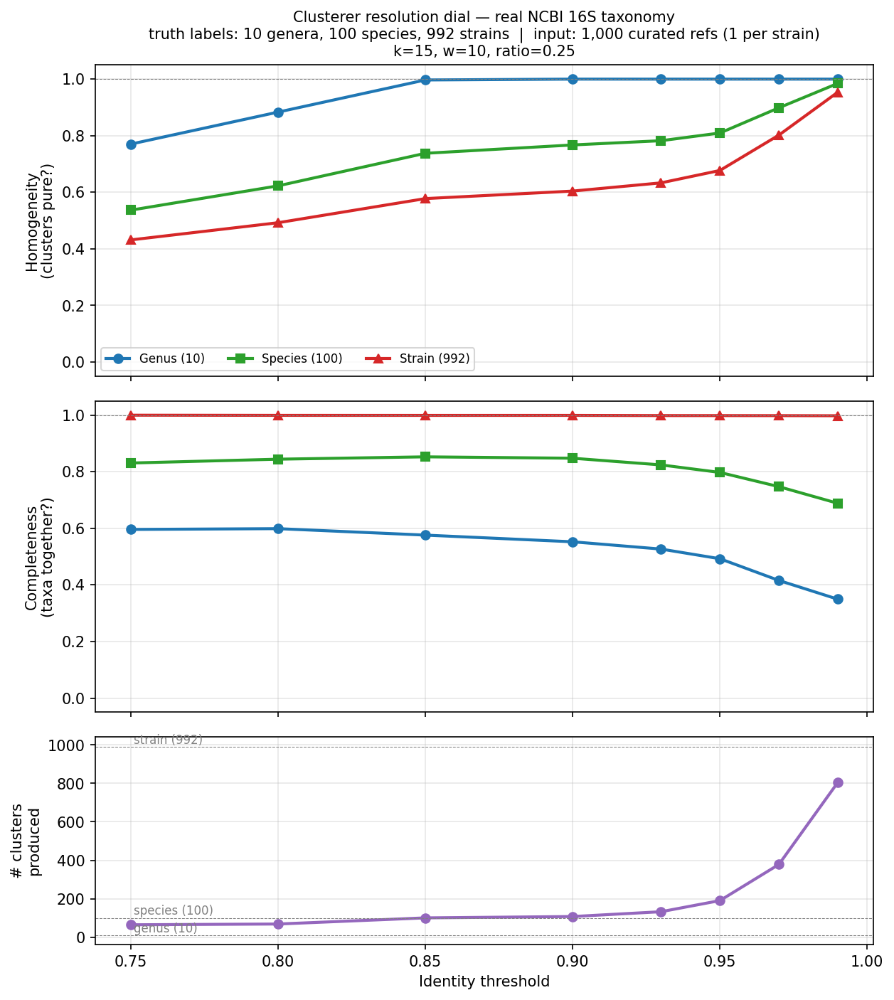

# NGS Diversity Analysis - Website Tutorial

This tutorial will guide you through using the NGS Diversity Analysis platform to analyze genetic diversity in your sequencing data. By the end of this guide, you'll know how to upload files, run analyses, and interpret your results.

## Table of Contents

1. [Introduction](#introduction)
2. [Getting Started](#getting-started)
3. [Working with Projects](#working-with-projects)
4. [Uploading and Managing Files](#uploading-and-managing-files)
   - [Pinned Files](#pinned-files)
5. [Running Analyses](#running-analyses)
   - [Demultiplexing](#demultiplexing)
   - [Clustering](#clustering)
   - [Diversity Analysis](#diversity-analysis)
6. [Monitoring Jobs and Viewing Results](#monitoring-jobs-and-viewing-results)
7. [Complete Workflow Example](#complete-workflow-example)
8. [Tips and Best Practices](#tips-and-best-practices)

---

## Introduction

The NGS Diversity Analysis platform provides a complete pipeline for analyzing genetic diversity in next-generation sequencing (NGS) data. The platform supports three main analysis types:

- **Demultiplexing**: Assign sequencing reads to their corresponding sample barcodes
- **Clustering**: Group similar sequences together based on sequence identity
- **Diversity Analysis**: Calculate diversity metrics (richness, Shannon index, Simpson index) for each sample

The platform is organized around **Projects**, which contain your uploaded **Files** and analysis **Jobs**.

---

## Getting Started

### Logging In

1. Navigate to the platform website
2. Click "Log In" to access your account
3. After logging in, you'll see the Projects overview page

### Understanding the Interface

The platform follows a simple hierarchy:

```
Projects
  └── Files (your uploaded data)
  └── Jobs (your analyses)
        └── Results (downloadable outputs)
```

The main navigation allows you to:
- View all your projects
- Access individual project details
- Monitor running jobs
- Download results

---

## Working with Projects

Projects help you organize related analyses together. For example, you might create separate projects for different experiments or sample sets.

### Creating a New Project

1. From the Projects page, click "New Project"
2. Enter a **Project Name** (required)
3. Optionally add a **Description**
4. Click "Create"

Your new project will appear in the project list.

### Managing Projects

Within each project, you can:

- **Rename**: Click on the project settings to change the project name
- **Delete**: Remove the entire project (requires typing "CONFIRM" for safety)

> **Warning**: Deleting a project will permanently remove all associated files, jobs, and results.

---

## Uploading and Managing Files

Before running any analysis, you need to upload your input files.

### Supported File Types

| Category | File Types | Requirements |
|----------|-----------|--------------|
| **FASTQ Reads** | Nanopore, Illumina, PacBio | Must be compressed (.gz or .zip) |
| **FASTA Sequences** | Barcodes, Target sequences, Adapter sequences, Other | Can be compressed or uncompressed |
| **Result Files** | Demux results, Cluster databases, Analysis results | ZIP archives |

### Preparing Your Files

**FASTQ files** must be compressed before uploading. If you have multiple FASTQ files from the same sample that need to be combined, see our [FASTQ Concatenation Guide](fastq-concatenation-guide.md) for instructions.

**FASTA files** containing your barcodes should have one sequence per barcode, with the header line containing the barcode/sample name:

```
>Sample_01
ACGTACGTACGT
>Sample_02
TGCATGCATGCA
```

### Uploading Files

1. Navigate to your project
2. Click the "Files" tab
3. Click "Upload File"
4. Either drag and drop your file or click to browse
5. Select the appropriate **File Type** from the dropdown
6. Optionally add a **Description**
7. Click "Upload"

A progress bar will show the upload status. Large files may take several minutes.

### Managing Uploaded Files

In the Files tab, you can:

- **View** file details (name, type, size, upload date)
- **Download** files for local use
- **Delete** files you no longer need

### Pinned Files

Files are automatically deleted after 60 days to manage storage costs. If you have important files you want to keep permanently (like reference sequences or barcode files), you can **pin** them.

#### What Pinning Does

- **Prevents automatic deletion**: Pinned files are protected from the 60-day lifecycle rule
- **Cross-project access**: Pinned files appear in ALL your projects, making them easy to reuse
- **Available in job dropdowns**: When creating jobs, pinned files from other projects appear in the file selection dropdowns

#### How to Pin/Unpin Files

1. Navigate to the Files tab in any project
2. Find the file you want to pin
3. Click the **pin icon** in the Actions column
4. The file status will change to "Pinned" (blue badge)
5. To unpin, click the pin icon again

#### Cross-Project File Sharing

When you pin a file, it becomes available across all your projects:

- **In file lists**: Pinned files from other projects appear in a separate section at the top labeled "Pinned Files from Other Projects"
- **In job creation**: When selecting files for a job, pinned files from other projects appear in the dropdown with their source project name, e.g., `reference.fasta (from Lab Samples)`

This is useful for:
- Sharing reference sequences across multiple experiments
- Reusing barcode files without re-uploading
- Maintaining a library of commonly used files

> **Note**: You cannot delete a pinned file. Unpin it first if you need to remove it.

---

## Running Analyses

From the "Jobs" tab in your project, click "Create Job" to start a new analysis.

### Demultiplexing

**Purpose**: Assign sequencing reads to their corresponding sample barcodes.

This is typically the first step when processing multiplexed sequencing data.

#### Required Inputs

| Input | Description |
|-------|-------------|
| Input FASTQ File | Your compressed sequencing reads |
| Barcode FASTA File | FASTA file containing your sample barcodes |

#### Parameters

| Parameter | Range | Default | Description |
|-----------|-------|---------|-------------|
| Minimum Quality Score | 0-50 | 18.0 | Minimum average quality score for a read to pass quality filtering |
| Maximum Errors | 0+ | 10 | Sum of total errors (indels + snps) in forward and reverse barcodes if matching both ends, or maximum errors for the best end if not both ends required |
| Require Barcode Match at Both Ends | on/off | on | When enabled, the same barcode must be found at both the start and end of each read. Automatically sets max errors to 10. See [Barcode Matching Algorithm](#barcode-matching-algorithm) for details |

#### Outputs

- **Total Reads**: Number of reads processed
- **Assigned Reads**: Number of reads matched to a barcode
- **Assignment Rate**: Percentage of reads successfully assigned
- **Per-barcode counts**: Breakdown of reads per sample
- **Downloadable files**: Summary file and demux archive (ZIP)

#### Methods

The demultiplexer assigns reads to sample barcodes using [edlib](https://github.com/Martinsos/edlib) semi-global alignment (edit distance), implemented in C++. The algorithm is modeled after [dorado](https://github.com/nanoporetech/dorado)'s fuzzy barcode matching.

**Step 1: Barcode Loading and Grouping**

Barcodes are loaded from a FASTA file and grouped by normalized name. Orientation suffixes (`_FWD`, `_REV`, `_REVCOMP`, case-insensitive) are stripped so that all orientation variants of a barcode are searched together. Reverse complements are **not** computed at runtime — they must be provided as separate entries in the barcode FASTA file. All barcode sequences are uppercased on load.

**Step 2: Barcode Matching Algorithm**

**How ONT native barcodes work:** During library prep (e.g., SQK-NBD114-96), a barcode adapter ligates to both ends of each DNA fragment. Each barcode has one canonical 24bp sequence. Because DNA is double-stranded, when the nanopore reads one strand 5'→3':

```
5'─[flank]─[BARCODE_FWD]─[flank]─── insert DNA ───[flank]─[BARCODE_REVCOMP]─[flank]─3'
   (start of read)                                                    (end of read)
```

- The **forward barcode** appears near the **start** of the read
- The **reverse complement** of the same barcode appears near the **end** of the read
- This is a single barcode, double-ended kit — both ends carry the same barcode (one in each orientation)

The barcode FASTA provides both orientations explicitly (e.g., `NB01_FWD` and `NB01_REV`), which are grouped under a single barcode name during loading.

For each read, every barcode is scored by aligning all of its sequence variants (forward, reverse complement) against the **full read** using edlib in semi-global mode (`EDLIB_MODE_HW`). This mode finds the best location for the barcode anywhere within the read, allowing insertions, deletions, and substitutions. No windowing or edit-distance cutoff is applied to edlib — it always returns the globally optimal alignment.

For each barcode, the forward variant typically aligns near the start of the read and the reverse complement near the end. The **top penalty** (better end's edit distance) is the lower ED of the two orientations, and the **bottom penalty** (worse end's edit distance) is the higher ED.

**Scoring and classification** depend on the mode:

- **Default mode** (`barcode_both_ends = off`): The barcode's score is the minimum edit distance across all variants. The read is classified to the barcode with the lowest score, provided it is within `max_errors`.

- **Both-ends mode** (`barcode_both_ends = on`): Both the forward and reverse complement variants must produce valid alignments. The barcode's score is the **sum** of the top and bottom penalties (combined edit distance). The read is classified to the barcode with the lowest combined score, provided the combined score ≤ `max_errors`.

**Ambiguity filtering:** After selecting the best barcode, the gap between the best and second-best barcode scores is checked. If the gap is less than 3 edit distances (`min_barcode_penalty_dist = 3`), the read is classified as "unclassified" to avoid ambiguous assignments. This prevents mis-classification when two barcodes score similarly.

**Step 3: Quality Filtering**

Reads are classified as "pass" or "fail" based on average PHRED quality scores:

```
Q_avg = (1/n) × Σᵢ (ASCII(qᵢ) - 33)
```

Where 33 is the PHRED33 offset (Illumina 1.8+, Nanopore standard). Reads with `Q_avg >= min_quality` (default 18.0) are classified as "pass"; all others as "fail." Both categories are written to separate output subdirectories, preserving the full original read and quality string without trimming.

**Step 4: Barcode Info Output**

A per-read diagnostic TSV (`barcode_info.tsv`) is always generated, containing for every read:
- Classification result and edit distances for each variant at each end
- Normalized alignment positions, combined penalty, penalty gap, and barcode score (0–1)

This file is used to generate QC plots (barcode overview, edit distance distributions, position analysis) that are included in the result archive.

**Step 5: Output**

Demultiplexed reads are organized into a directory hierarchy:
```
output_dir/
├── barcode01/pass/reads.fastq
│            /fail/reads.fastq
├── barcode02/pass/reads.fastq
│            /fail/reads.fastq
├── unclassified/pass/reads.fastq
│               /fail/reads.fastq
├── barcode_info.tsv
├── barcode_overview.png
├── barcode_edit_distances.png
├── barcode_positions.png
├── demux_summary.txt
└── params.txt
```

Barcode directory names are normalized (e.g., `NB01` → `barcode01`). Output file handles are lazily created and cached to avoid repeated file opens.

**Parallelization:**

- Reads are streamed from the input FASTQ in batches of 10,000
- Barcode matching and quality scoring are parallelized across threads using [OpenMP](https://www.openmp.org/) (`schedule(dynamic)`)
- File writes are sequential (single-threaded) to prevent I/O conflicts
- Thread count is auto-detected via `std::thread::hardware_concurrency()`

#### Performance

| Aspect | Details |
|--------|---------|
| **Complexity** | O(N × B × L) where each barcode variant is aligned against the full read |
| **Bottleneck** | edlib alignment (mitigated by OpenMP parallelization) |
| **Parallelization** | Matching parallelized (OpenMP dynamic), writes sequential |

Where:
- **N** = number of input reads
- **B** = number of barcodes (× orientation variants per barcode)
- **L** = average read length

---

### Clustering

**Purpose**: Group similar sequences together based on sequence identity.

Use this to cluster your reference sequences (curated FASTA databases — dedupe redundant entries, build a reference DB for downstream Diversity Analysis), **or** to cluster FASTQ reads directly (dedupe redundant reads from the same source DNA, e.g. nanopore amplicon data — output is a `Clustered Reads` archive that downstream Diversity Analysis can consume for weighted mapping).

#### Required Inputs

| Input | Description |
|-------|-------------|
| Input FASTA or FASTQ File | Sequences to cluster. FASTA inputs (target/other reference sequences) are clustered as-is. FASTQ inputs (Nanopore, Illumina, PacBio, generic) are quality-filtered, converted to FASTA, then clustered with `strand_aware=true` so reverse-complement reads collapse into the same cluster as their forward strand. FASTQ runs additionally produce a `Clustered Reads` archive that can be passed directly to a downstream Diversity Analysis job for weighted mapping. |

#### Basic Parameters

| Parameter | Range | Default | Description |
|-----------|-------|---------|-------------|
| Identity Threshold | 0.5-1.0 | 0.97 | Minimum sequence identity to cluster sequences together |
| Min Read Quality (FASTQ only) | 0-50 | 18 | Average Phred quality below which a read is dropped before clustering. Set to 0 to disable. Ignored for FASTA input. |

#### Advanced Parameters

| Parameter | Range | Default | Description |
|-----------|-------|---------|-------------|
| K-mer Size | 5-31 | 15 | K-mer size for minimizer sketching |
| Window Size | 1-50 | 10 | Window size for minimizer selection |
| Minimizer Match Ratio | 0.0-1.0 | 0.25 | Fraction of the query's minimizers a candidate centroid must share before alignment is attempted. The per-query threshold is computed dynamically as `max(1, ratio × query_minimizers)`, so longer sequences automatically get a higher bar (faster filtering) while short reads aren't over-filtered. Higher = faster, possibly missing weak matches; lower = more thorough, slower. |

#### Outputs

- **Number of Clusters**: Total clusters created
- **Total Sequences**: Input sequence count (after FASTQ quality filtering, when applicable)
- **Unique Sequences**: Sequences after clustering
- **Compression Ratio**: Reduction achieved by clustering
- **Downloadable files**:
  - **Cluster Database archive (ZIP)** — always produced. Contains `clusters.json` (centroid sequences, member lists with `member_ids`, duplicate counts), `centroids.fa`, `cluster_summary.txt`, and `params.txt`.
  - **Clustered Reads archive (ZIP)** — produced only for FASTQ input. Bundles the cluster database alongside per-read information so a downstream Diversity Analysis job can weight reads by upstream cluster size.

#### Methods

The clustering module implements a **greedy minimizer-based clustering** approach using the [edlib](https://github.com/Martinsos/edlib) library (v1.2.7) for sequence identity verification.

**Step 1: Sequence Deduplication**

Before clustering, exact duplicate sequences are removed using an `std::unordered_map` keyed by sequence string. Duplicate counts are preserved and propagated into final cluster sizes, ensuring abundance-weighted centroid selection. Time complexity: O(N) where N = total input sequences.

**Step 2: Minimizer Extraction**

Minimizers are compact sequence signatures used for fast similarity detection without full alignment. For each unique sequence:

1. A sliding window of size `w` (default 10) moves across the sequence from position 0 to `length - k`
2. Within each window, the **lexicographically smallest k-mer** (of length `k`, default 15) is selected
3. Selected minimizers are stored in an `std::unordered_set<std::string>`, automatically deduplicating
4. The resulting set forms a compact "sketch" of the sequence

```
Example (k=4, w=3):
Sequence: ACGTACGTAC
Windows:  [ACGT] [CGTA] [GTAC] [TACG] [ACGT] [CGTA] [GTAC]
Minimizers selected: {ACGT, CGTA, GTAC, TACG}
```

Minimizer extraction is parallelized using OpenMP with dynamic scheduling (chunk size 100).

**Step 3: Candidate Selection via Inverted Index**

An inverted index (`std::unordered_map<string, unordered_set<size_t>>`) maps each minimizer to the set of cluster IDs containing it. For each query sequence:

1. Look up each of the query's minimizers in the inverted index
2. Count shared minimizers per candidate cluster using a hash map
3. Filter using a **per-query dynamic threshold**: `dynamic_msm = max(1, minimizer_match_ratio × |query_minimizers|)` (default ratio 0.25). A candidate must share at least this many minimizers with the query to survive. Because the bar scales with query length, short reads aren't over-filtered (the floor of 1 still admits low-minimizer reads), while long sequences automatically get a stricter cutoff that prunes most of the candidate pool before alignment.
4. Sort remaining candidates by shared count in descending order (most-shared first)

This reduces pairwise comparisons from O(n²) to O(n × c) where c is the average number of candidates per sequence.

**Step 4: Identity Verification (edlib)**

Top candidates are verified using the edlib library (Needleman-Wunsch global alignment, distance-only mode):

1. **Length pre-filter:** Compute `max_possible_identity = 1.0 - (length_diff / max_length)`. If this is below `identity_threshold`, skip the expensive alignment entirely.
2. **Edit distance:** Compute via `edlibAlign()` with `edlibDefaultAlignConfig()` (NW global alignment, unit costs for mismatch/indel, no traceback).
3. **Identity calculation:**
   ```
   identity = (max(len₁, len₂) - edit_distance) / max(len₁, len₂)
   ```
4. Accept if `identity >= identity_threshold` (default 0.97)

**Step 5: Greedy Assignment**

Sequences are processed in **input order** (not sorted by length or abundance):

- The first unique sequence becomes cluster 0's centroid
- Each subsequent sequence is compared against candidates from the inverted index
- On first match meeting the identity threshold, the sequence joins that cluster
- If no match is found, the sequence starts a new cluster as its centroid
- **Centroid update rule:** If a newly assigned sequence has a higher duplicate count than the current centroid, it replaces it as the cluster representative
- The inverted index is updated with new centroid minimizers after each assignment

**Parallelization:**

- Sequences are divided into batches of size `max(100, num_sequences / (4 × num_threads))`
- **Parallel phase:** Candidate finding and identity verification run in parallel (OpenMP, dynamic scheduling). Early match detection across threads uses `omp flush` and `omp critical` to avoid redundant alignments.
- **Sequential phase:** Cluster assignments, centroid updates, and inverted index updates are sequential to prevent race conditions.

**Output:**

- `clusters.json`: Complete cluster database with centroid names, sequences, member lists (including `member_ids` to round-trip back to original input names), and duplicate counts
- `centroids.fa`: FASTA file of cluster representative sequences (headers: `cluster_XXXX_<name>_size_<count>`)
- `cluster_summary.txt`: Human-readable summary with cluster size statistics. For FASTQ input, the summary also includes a **FASTQ Quality Filter** block reporting reads kept / dropped and the active `min_quality` threshold.
- `params.txt`: Exact parameters used (identity threshold, k, w, minimizer_match_ratio, strand_aware, ...).

#### Choosing parameters by target resolution

The clusterer has two knobs that together control how aggressively it merges:

- `identity_threshold` — minimum sequence identity for two inputs to share a cluster (the **alignment gate**).
- `minimizer_match_ratio` — fraction of the query's minimizers a candidate must share before alignment runs (the **prefilter**).

Both must let a pair through for it to merge. Most users only ever need to touch `identity_threshold`; `minimizer_match_ratio` only matters when you push identity below ~0.80, which is rare.

The recommendations below come from running `python/sweep_taxonomy_clusterer.py` against a stratified real-NCBI 16S fixture: **10 genera × 10 species/genus × 10 strains/species = 1,000 full-length 16S references** pulled from NCBI's broad nuccore 16S pool.

The plot has three stacked panels: **Homogeneity** ("are the predicted clusters pure at this taxonomic level?" — drops on over-merging), **Completeness** ("do all members of one taxon land in the same cluster?" — drops on over-fragmentation), and **# clusters produced**, all as a function of `identity_threshold`. Three curves per panel: genus / species / strain.


*Sweep on 1,000 real NCBI 16S refs at default parameters. The strain-level dial works (homogeneity rises with identity, completeness pinned near 1.0). Species-level is partial. Genus completeness floors around 0.55–0.60 because cross-genus pairs never enter the candidate pool at id ≥ 0.80. Loosening `minimizer_match_ratio` toward 0.05 produces a near-identical plot in this id range — the alignment gate is what's binding, not the prefilter.*

**Tier 1 — Strain-level dedup (the production case)**

Use `identity_threshold = 0.97`, `minimizer_match_ratio = 0.25` (both defaults). On 1,000 real refs:

| Metric | Genus | Species | Strain |
|--------|------:|--------:|-------:|
| Homogeneity | 1.000 | 0.899 | 0.802 |
| Completeness | 0.416 | 0.747 | **0.998** |

Reading: **378 clusters out of 992 distinct strain truth labels.** Strain completeness is ~1.0 (every strain's refs land together), homogeneity is high enough that clusters don't mix strains across species lines (H(species)=0.90 means 90% of cluster mass comes from a single species). The partition is finer than strain (some near-identical strains do split apart at 97% identity), which is exactly the right behavior for "preserve every distinct sequence in a curated reference DB." Don't change this for the typical workflow.

**Tier 2 — Species-level grouping (collapse strains within a species)**

Lower `identity_threshold` to **0.85–0.90**, leave `minimizer_match_ratio = 0.25`. On 1,000 real refs at id=0.85:

| Metric | Genus | Species | Strain |
|--------|------:|--------:|-------:|
| Homogeneity | 0.997 | 0.738 | 0.578 |
| Completeness | 0.576 | 0.853 | 0.999 |

100 clusters total. Species-completeness rises to 0.85 (most species do land in a single cluster); H(species)=0.74 because some species pairs at the lower end of intra-species 16S divergence merge with each other. Strain still preserved (C=1.0) but no longer the dominant grouping (H drops). This is "good enough" species-mostly-pure clustering, useful when you want to collapse near-redundant strains but keep distinct species apart. Below 0.85 with default prefilter the result barely changes — at id=0.80 you get 68 clusters and H(genus)=0.88, but cross-species merges have already started.

**Tier 3 — Coarser than species (genus-level grouping)**

The clusterer **does not produce a clean genus partition** at any combination of `identity_threshold` and `minimizer_match_ratio` we've tested. Going below id=0.85 (the right edge of the plot above is 0.75) gets into a regime that *is* visible in the chart — H(genus) starts dropping from 1.0 — but the underlying behavior on the same 1,000-ref fixture is:

- At `identity_threshold = 0.75` (default prefilter): 64 clusters, H(genus)=0.77, C(genus)=0.60.
- At `identity_threshold = 0.75` with **loose prefilter (`ratio=0.05`)**: 40 clusters, H(genus)=0.63, C(genus)=0.62. The best partial-genus result on any sweep we ran, but H(genus)=0.63 means about a third of cluster mass comes from outside the dominant genus.
- At `identity_threshold ≤ 0.70` (any prefilter): **the partition collapses to 2–4 mega-clusters covering the whole input** — e.g. 4 clusters total at id=0.70, 2 clusters at id=0.50. H(genus) crashes to **0.02**: those mega-clusters mix all genera indiscriminately. There is no monotonic descent into a clean genus partition; the transition from "partial genus mode" (id=0.75) to "everything merges" (id=0.70) is a cliff.

The mechanism: at id ≥ 0.80 the alignment gate itself blocks cross-genus pairs (real cross-genus 16S identity is ~75–85%), so loosening the prefilter doesn't help — both prefilter settings produce identical partitions at id ≥ 0.80. Below id=0.75 the alignment gate starts admitting cross-genus pairs, but it admits them indiscriminately because the underlying 16S signal at that level is too noisy for the greedy-minimizer design to discriminate genera apart.

**Practical takeaway**: the validated dial covers strain (id=0.97) and partial-species (id=0.85–0.90). Anything coarser is not a supported mode of the clusterer on full-length 16S — even the best parameter combo we found gives H(genus) ≈ 0.63 with C(genus) ≈ 0.62, well below the ~0.95 threshold you'd want for a usable genus partition.

**Validating your own runs**

If you push `identity_threshold` away from the defaults, validate the partition before trusting it. Compute homogeneity and completeness against your ground-truth taxonomy with `sklearn.metrics.homogeneity_score` and `sklearn.metrics.completeness_score` — pass two parallel label vectors (truth taxon per input, predicted cluster ID per input). The benchmark script `python/sweep_taxonomy_clusterer.py` is a working template. **Don't rely on ARI alone** — it mashes over-merging and over-fragmentation into one number that can hit zero even when the partition is fine.

#### Performance

| Aspect | Details |
|--------|---------|
| **Complexity** | O(U × C × L) after deduplication, where C = avg candidates |
| **Bottleneck** | Edit distance computation (edlib global alignment) |
| **Parallelization** | Candidate finding + identity verification parallel (OpenMP); assignment sequential |

Where:
- **U** = number of unique sequences (after removing exact duplicates)
- **C** = average number of candidate clusters per sequence (controlled by `minimizer_match_ratio` — see Step 3)
- **L** = average sequence length

---

### Diversity Analysis

**Purpose**: Calculate genetic diversity metrics for a set of reads against a reference database.

A diversity job has **two independent input toggles** in the UI: a **Target Sequences Source** (the reference centroids reads are mapped *against*) and a **FASTQ Reads Source** (the reads to be mapped). Pick one option from each. An optional Exclude Sequences FASTA can also be attached.

#### Required Inputs

**Target Sequences Source** — pick one:

| Option | Description |
|--------|-------------|
| Cluster Result | Output from a previous Clustering job on your reference / target FASTA. Provides centroids (one per cluster) as the reference database. |
| Target FASTA File | A raw target-sequences FASTA. Each sequence is treated as its own cluster of size 1, so this is a quick alternative when you don't need clustering on the reference side. |

**FASTQ Reads Source** — pick one:

| Option | Description |
|--------|-------------|
| Demux Result | Output from a previous Demultiplexing job. Per-barcode reads are mapped, giving per-sample diversity. |
| FASTQ File | A single uploaded FASTQ file, no demultiplexing. All reads are treated as one bulk `sample_all` group. |
| Clustered Reads Result | Output from a previous Clustering job that was run on a FASTQ file. Each upstream centroid is used as a single query and its `member_count` is propagated as a weight, so abundance and diversity reflect the original read count rather than the deduplicated representatives. |

**Optional:**

| Option | Description |
|--------|-------------|
| Exclude Sequences | FASTA file of sequences to filter out before diversity calculation (host DNA, known contaminants, spike-ins, etc.). Reads matching anything here above `identity_threshold` are dropped. |

#### Basic Parameters

| Parameter | Range | Default | Description |
|-----------|-------|---------|-------------|
| Identity Threshold | 0.5-1.0 | 0.95 | Identity threshold for mapping reads to clusters |
| Max Candidates | 1-100 | 10 | Maximum candidate clusters to consider per read |
| Max Reads | 0+ | 0 (unlimited) | Limit number of reads to process (0 = all) |

#### Note: Read Deduplication Moved Upstream

Pre-clustering reads before mapping (to deduplicate redundant reads and reduce BLAST queries on high-error-rate data) is no longer an option inside the diversity job. Run a **Clustering job on your FASTQ first** and then pass that result as the **Clustered Reads** input above — the upstream cluster's `identity_threshold`, `k`, `w`, and `minimizer_match_ratio` are now what control the deduplication behavior, and the `member_count` of each centroid becomes the per-read weight automatically.

#### Outputs

For each barcode/sample:

| Metric | Description |
|--------|-------------|
| Total Reads | Number of reads for this sample (weighted, when a Clustered Reads input is supplied) |
| Read Clusters | Number of upstream read clusters used as queries (only when a Clustered Reads input is supplied) |
| Duplicates Collapsed | Reads collapsed into upstream centroids by the Cluster Reads job (only when a Clustered Reads input is supplied) |
| Mapped Reads | Reads successfully mapped to reference clusters |
| Mapping Rate | Percentage of reads mapped |
| Richness | Number of unique sequences detected |
| Shannon Index | Diversity measure (higher = more diverse) |
| Simpson Index | Probability two random reads are different |
| Evenness | How evenly reads are distributed |

#### Methods

The diversity analyzer maps demultiplexed reads to reference database clusters using [BLAST+](https://ftp.ncbi.nlm.nih.gov/blast/executables/blast+/2.17.0/) (v2.17.0) and computes ecological diversity metrics. The C++ core (`ngs_diversity.DiversityAnalyzer`) orchestrates the following pipeline for each barcode.

**Step 1: Cluster Database Loading**

The cluster database (from a previous clustering job) is parsed from JSON format using the [nlohmann/json](https://github.com/nlohmann/json) library (v3.11.2):
- Cluster centroids become the reference sequences for BLAST alignment
- Optional filtering by `min_cluster_size` removes small clusters (default: 1, include all)
- Clusters are re-indexed contiguously (0 to N-1) for efficient O(1) vector-based lookups

**Step 2: BLAST Database Creation**

A BLAST nucleotide database is created from cluster centroid sequences:
- Centroid names are hashed (`"seq_" + hex(std::hash<string>(name))`) for BLAST sequence ID compatibility
- `makeblastdb -dbtype nucl -parse_seqids` creates the binary database
- A reverse lookup map (hash → cluster ID) enables fast result parsing
- The database is created once and reused across all barcodes

**Step 3: Exclude Sequence Filtering (Optional)**

When an exclude sequences FASTA is provided, a separate BLAST database is built from the exclude sequences and reads are filtered before mapping:
- Reads matching any exclude sequence at `>= identity_threshold` are removed
- Per-exclude-sequence statistics (read count, average identity) are tracked
- Excluded reads are counted separately and do not contribute to diversity metrics

**Step 4: Optional Weighted Mapping from Clustered Reads**

When a **Clustered Reads** input is supplied (output of a Cluster Reads job on a FASTQ file), the analyzer reads its `clusters.json` and:
- Uses each centroid sequence as the BLAST query (instead of every individual read)
- Propagates the centroid's `member_count` as the weight on the resulting `ReadMapping.weight`, so abundance and diversity indices reflect the original input read count rather than the deduplicated representative count
- Reduces BLAST queries by 50-90% for redundant data, particularly nanopore reads where many reads collapse into a single centroid

When no Clustered Reads input is supplied, every read is mapped individually with weight 1 (no upstream weighting).

> **What is and isn't weighted by upstream cluster size**
>
> When a Clustered Reads input is supplied, upstream cluster sizes (which already include exact-dedup counts from the Cluster Reads job) are propagated through `ReadMapping.weight` and consumed by `AbundanceCalculator`. The resulting numbers split into two groups:
>
> **Weighted (reflects original input read count):**
> - `Read_Count`, `Percent_Total` per cluster
> - `total_reads`, `mapped_reads`, `unmapped_reads`
> - Shannon, Simpson, Evenness, Richness — all driven by the weighted per-cluster counts
>
> **NOT weighted (computed over representatives only):**
> - `Avg_Identity`, `Avg_Read_Length`, `Avg_Read_Coverage_Pct`
>
> The "avg" columns are unweighted means over the upstream *centroids*, not the original reads. If an upstream centroid represents 5,000 reads pre-clustered down to one query, `Avg_Identity` is one identity value contributing once to the mean, not 5,000 times. The reads collapsed into each upstream centroid contribute zero information to these averages — this is by design, since collapsed reads are never individually BLAST-aligned and so per-read identity simply doesn't exist for them.

**Step 5: Read Mapping via BLAST**

Reads (or pre-cluster representatives) are mapped to the centroid database using BLAST megablast as a candidate prefilter, followed by an edlib global verification step that picks the final cluster assignment:

| BLAST Parameter | Value | Source |
|-----------------|-------|--------|
| Task | megablast | Optimized for high-identity nucleotide alignments |
| Word size | 16 | `blast_utils.hpp` constant |
| Query coverage | `min_read_coverage` (default 60) | User parameter — minimum % of the read that must align to a centroid for the hit to be considered |
| E-value | 1e-20 | `blast_utils.hpp` constant |
| Max target seqs | `max_candidates` (default 10) | User parameter |
| Low-complexity filter | `-dust yes -soft_masking true` | Hardcoded |
| Percent identity | `identity_threshold × 100` | User parameter (default 95%) |

For each batch of reads (batch size = 2,500):
1. Reads are written to a temporary FASTA query file
2. `blastn` is executed with the parameters above and `-num_threads` set to available CPUs
3. Tabular output (`outfmt 6`) is parsed: `qseqid sseqid pident length qlen qstart qend sstart send`
4. Hash-based subject IDs are resolved to cluster IDs via the reverse lookup map
5. **Group HSPs by cluster.** A single read can match multiple HSPs against the same centroid; for each candidate cluster the highest-pident HSP is kept (used only for strand and subject coverage — edlib does its own global alignment from scratch).
6. **Edlib HW global verification.** For each unique candidate cluster, the read is aligned to the centroid using edlib in semi-global (HW) mode (`EDLIB_MODE_HW`, `EDLIB_TASK_DISTANCE`). The shorter of `(read, centroid)` is the query, the longer is the target. If the candidate's best HSP was on the reverse strand, the read is reverse-complemented before alignment. Identity is computed as `1 - editDistance / query.size()`.
7. **Pick the winner by edlib identity, not megablast pident.** Candidates are sorted descending by edlib identity, tie-broken by lowest `cluster_id` for reproducibility. The winner becomes the read's assigned cluster. This is critical for strain-level work: megablast pident is local and noisy, so two near-identical centroids can return the same pident even when global identity clearly favors one. The edlib re-pick gives a globally meaningful score and prevents the cluster choice from being driven by BLAST hit ordering.
8. **Identity gap to second-best.** `ReadMapping.identity_gap_to_second` records `winner_identity − runner_up_identity`. If only one candidate cluster exists, the gap is set to 1.0 (the "no rival" sentinel). Small positive values (e.g. < 0.005) flag reads where two or more centroids are near-tied, which is the strain-level ambiguity signal that downstream consumers can use to drop, downweight, or report ambiguous reads separately.
9. Subject coverage is calculated from the winner's best HSP: `(|subject_end - subject_start| + 1) / centroid_length × 100`
10. Strand is determined from the winner's best HSP: forward if `subject_start < subject_end`, reverse otherwise

Temporary query and result files are cleaned up after each batch. The `/tmp` directory uses job-specific subdirectories to prevent collisions between concurrent analyses.

**Parallelization:** BLAST runs with `-num_threads = available CPUs`. The edlib re-score over each read's candidate clusters (step 6 above) is also OpenMP-parallelized across reads inside the C++ `ReadMapper`, so re-verification scales with thread count rather than running serially per batch.

**Step 6: Diversity Metric Calculation**

For each barcode/sample, abundance is computed from weighted read-to-cluster mappings, then ecological diversity indices are calculated from the abundance distribution:

| Metric | Formula | Interpretation |
|--------|---------|----------------|
| **Richness (S)** | Count of unique clusters with ≥ 1 mapped read | Number of distinct sequence types |
| **Shannon Index (H')** | −Σ(pᵢ × ln(pᵢ)) | Higher = more diverse; uses natural logarithm |
| **Simpson Index (1-D)** | 1 − Σ(pᵢ²) | Probability two randomly selected reads are from different clusters |
| **Pielou's Evenness (J')** | H' / ln(S) | How evenly reads are distributed (0–1); returns 0 when S ≤ 1 |

Where **pᵢ = (weighted reads in cluster i) / (total mapped reads)**. Unmapped reads are excluded from diversity calculations. When read pre-clustering is enabled, all counts use the weighted values (cluster size × representative count). NaN and infinity safety checks are applied to all computed indices.

**Example Calculation:**
```
Sample with 100 mapped reads across 3 clusters: [50, 30, 20]
p = [0.5, 0.3, 0.2]

Richness = 3
Shannon  = -(0.5×ln(0.5) + 0.3×ln(0.3) + 0.2×ln(0.2)) = 1.03
Simpson  = 1 - (0.5² + 0.3² + 0.2²) = 0.62
Evenness = 1.03 / ln(3) = 0.94
```

**Step 7: Per-Barcode Output**

For each barcode, the analyzer writes:
- `{barcode}_abundance.tsv`: Cluster-level abundance table sorted by read count. Columns: `Cluster_ID`, `Centroid_Name`, `Read_Count` (weighted by upstream cluster size when a Clustered Reads input is supplied), `Percent_Total` (weighted), `Avg_Identity` (unweighted; mean over upstream centroids only when a Clustered Reads input is supplied), `Avg_Read_Length` (unweighted), `Centroid_Length`, `Avg_Read_Coverage_Pct` (unweighted)
- `{barcode}_excluded_abundance.tsv` (if exclude sequences used): Per-exclude-sequence statistics
- `diversity_metrics.tsv`: Global metrics table across all barcodes
- `diversity_summary.txt`: Human-readable summary with per-barcode breakdown and top clusters

#### Performance

| Aspect | Details |
|--------|---------|
| **Complexity** | O(N × log(K) × L) |
| **Bottleneck** | BLAST alignment |
| **Parallelization** | BLAST internal threading (`-num_threads`); edlib re-score across candidate clusters parallelized via OpenMP; barcodes processed sequentially |
| **Typical Speed** | Slowest of the three job types |

Where:
- **N** = number of reads to map (or upstream centroids, when a Clustered Reads input is supplied; can be 10-100× smaller than the raw read count)
- **K** = number of clusters in the reference database
- **L** = average sequence length

> **Tip**: For high-error nanopore data, run a Cluster Reads job on your FASTQ first and pass the output to Diversity as **Clustered Reads** — it dedupes redundant reads upstream, cutting BLAST queries 10-100× while preserving accurate abundance via per-centroid weights.

> **What `identity_threshold` does here vs. in clustering**
>
> The diversity job's `identity_threshold` is an **acceptance / quality gate**, not a taxonomic-resolution dial — a read with edlib identity below this threshold is dropped from mapping (counted as unmapped), regardless of whether the closest centroid is the right strain or just a related species. Taxonomic resolution (genus / species / strain) is set upstream by the **clusterer's** `identity_threshold`, which determines how finely the reference DB is split. Tightening the diversity threshold from 0.95 to 0.99 doesn't reveal more strains; it just rejects more low-confidence mappings.

---

## Monitoring Jobs and Viewing Results

### Job Status

Jobs progress through these states:

| Status | Description |
|--------|-------------|
| Queued | Job is waiting to start |
| Running | Job is actively processing |
| Completed | Job finished successfully |
| Failed | Job encountered an error |
| Cancelled | Job was manually stopped |

### Tracking Progress

While a job is running:
- A progress bar shows completion percentage
- Status messages describe current operations
- Duration is displayed in hours, minutes, seconds

The page automatically updates every few seconds.

### Viewing Results

Once a job completes:

1. Navigate to the job details page
2. View the results summary with key metrics
3. Download output files using the download buttons

### Job Actions

- **Cancel**: Stop a running or queued job
- **Delete**: Remove a job and its results

---

## Complete Workflow Example

Here's a typical end-to-end analysis workflow:

### Step 1: Create a Project

1. Click "New Project"
2. Name it "My Diversity Analysis"
3. Click "Create"

### Step 2: Upload Your Files

1. Go to the Files tab
2. Upload your compressed FASTQ reads (e.g., `reads.fastq.gz`)
3. Upload your barcode FASTA file (e.g., `barcodes.fasta`)
4. Upload your reference sequences (e.g., `reference.fasta`)

### Step 3: Run Demultiplexing

1. Go to Jobs tab, click "Create Job"
2. Select "Demultiplexing"
3. Choose your FASTQ file and barcode file
4. Use default parameters or adjust as needed
5. Click "Create Job"
6. Wait for completion

### Step 4: Run Clustering

1. Create another job
2. Select "Clustering"
3. Choose your input file. This can be either:
   - Your **reference FASTA** (target / other sequences) — produces the cluster database used as the reference in Diversity Analysis.
   - Your **FASTQ reads** — produces both a cluster database and a `Clustered Reads` archive that can be passed to Diversity Analysis for upstream-weighted mapping (recommended for nanopore data with many duplicate reads). When picking a FASTQ input, also set `Min Read Quality` to drop low-quality reads before clustering.
4. Leave `identity_threshold` at the default of `0.97` — that's the validated sweet spot for deduping a curated reference FASTA at strain level (see Clustering → "Choosing parameters by target resolution"). Only adjust if you specifically need coarser-than-strain output.
5. Click "Create Job"
6. Wait for completion

### Step 5: Run Diversity Analysis

1. Create another job
2. Select "Diversity Analysis"
3. Pick a **Target Sequences Source**:
   - Your completed **Cluster Result** (recommended — built from clustering your reference FASTA), OR
   - A raw **Target FASTA File** directly (each sequence treated as a singleton cluster)
4. Pick a **FASTQ Reads Source**:
   - Your completed **Demux Result** for per-sample diversity, OR
   - A FASTQ file directly for a single bulk sample, OR
   - A **Clustered Reads** result (from Step 4 if you clustered your FASTQ reads) for weighted mapping with deduplication
5. Adjust parameters if needed
6. Click "Create Job"
7. Wait for completion

### Step 6: Download Results

1. View your diversity analysis results
2. Download the summary file and analysis archive
3. Examine diversity metrics for each sample

---

## Tips and Best Practices

### File Preparation

- **Combine FASTQ files** from the same sample before uploading (see [FASTQ Concatenation Guide](fastq-concatenation-guide.md))
- **Compress large files** using gzip for faster uploads
- **Use descriptive names** for your files to easily identify them later

### Parameter Tuning

**For Demultiplexing:**
- Enable "Require barcode match at both ends" for double-ended barcode kits (e.g., ONT SQK-NBD114-96) — this sets max errors to 10 and requires the forward barcode near the read start and its reverse complement near the read end
- If assignment rate is low without both-ends mode, increase Max Errors to 1-2 for fuzzy matching
- Adjust Minimum Quality Score based on your sequencing platform

**For Clustering:**
- The default `identity_threshold = 0.97` is calibrated to **dedupe a curated reference FASTA at strain level** — each distinct strain-level sequence becomes one cluster, validated on real NCBI 16S. Don't change it for the typical "prep a reference DB for downstream Diversity Analysis" workflow.
- For **noisy reads** (Nanopore, raw FASTQ), 0.97 is also fine — the read-error rate is well within the acceptance window. The result still gives you per-strain-template clusters; downstream Diversity Analysis can use these as weighted queries.
- For **coarser-than-strain output** (collapse strains within species), lower `identity_threshold` toward 0.85–0.90; the default prefilter is fine. Below 0.85 the partition stops getting cleaner — see *Clustering → "Choosing parameters by target resolution"* for the full story including what fails at lower identity values.
- Don't rely on raw cluster counts or ARI alone to validate coarser-resolution output: check **homogeneity** (cluster purity) and **completeness** (taxa stay together) or eyeball the per-cluster member lists in `clusters.json`. ARI mashes both failure modes together and can hit zero on partitions that are otherwise fine.

**For Diversity Analysis:**
- For high-error nanopore data, run a **Cluster Reads** job on your FASTQ first and pass that result as the **Clustered Reads** input — this dedupes redundant reads upstream and propagates per-centroid weights into abundance and diversity indices.
- Remember that the diversity `identity_threshold` is an **acceptance gate** that rejects low-confidence mappings — it does *not* control whether reads are split at the genus, species, or strain level. That resolution is decided by the upstream clustering job's `identity_threshold` when you build your reference database.
- Use Max Reads to test parameters on a subset before full analysis.

### Troubleshooting

| Issue | Possible Cause | Solution |
|-------|---------------|----------|
| Low barcode assignment rate | Barcodes not matching | Check barcode sequences, ensure reverse complements are in FASTA, enable both-ends mode, or increase max errors |
| Job fails immediately | Invalid file format | Verify file is correctly formatted FASTQ/FASTA |
| Very slow processing | Large file size | Use Max Reads to limit processing, or wait for completion |
| No diversity results | No reads mapped | Check identity threshold, ensure reference matches your samples |

### Best Practices

1. **Start with default parameters** and adjust based on results
2. **Run a test analysis** on a small subset before processing full datasets
3. **Keep your projects organized** with clear naming conventions
4. **Download results promptly** as file URLs may expire
5. **Delete old jobs and files** to keep your project clean

---

## Need Help?

If you encounter issues not covered in this tutorial:

1. Check that your input files are correctly formatted
2. Review the job error messages for specific issues
3. Try running with default parameters first
4. Contact support with your job ID for assistance
